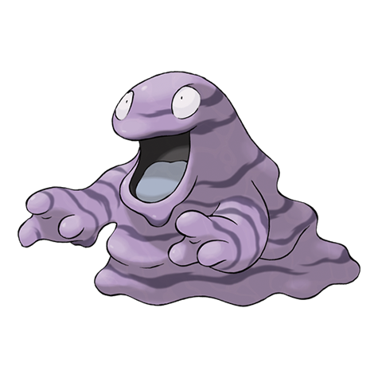

# Grimer (Alolan Form) (#0088A)

*Sludge Pokemon*

**Type:** Veleno / Buio
**Abilities:** [[Poison Touch]], [[Gluttony]], [[Power of Alchemy]] *(Hidden)*
**Base HP:** 3

> Grimer were brought into Alola to eat garbage on the region. It seemed like a counterintuitive measure but ended up solving the problem. But now Grimer are incredibly noxious, much more toxic than usual.

---

## Statistiche (Attributes & Limits)

| Attribute | Base / Limit |
|---|---|
| **Strength** | 2/5 |
| **Dexterity** | 1/3 |
| **Vitality** | 2/4 |
| **Special** | 1/3 |
| **Insight** | 2/4 |

---

## Mosse (Learnset)

- **Starter:** [[Pound|Pound]], [[Poison_Gas|Poison Gas]]
- **Beginner:** [[Harden|Harden]], [[Bite|Bite]], [[Disable|Disable]]
- **Amateur:** [[Acid_Spray|Acid Spray]], [[Poison_Fang|Poison Fang]], [[Minimize|Minimize]], [[Fling|Fling]], [[Knock_Off|Knock Off]], [[Crunch|Crunch]], [[Screech|Screech]]
- **Ace:** [[Gunk_Shot|Gunk Shot]], [[Acid_Armor|Acid Armor]], [[Belch|Belch]], [[Memento|Memento]]
- **Pro:** [[Assurance|Assurance]], [[Clear_Smog|Clear Smog]], [[Shadow_Sneak|Shadow Sneak]]

---
