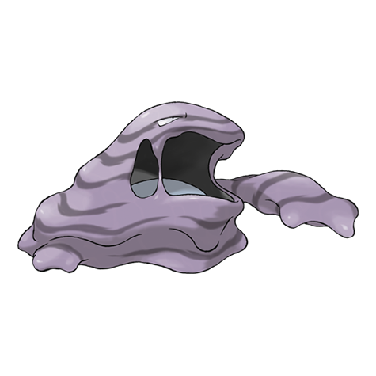

---
title: "Muk (#0089)"
category: Pokedex
tags: [muk, kanto, poison]
image: "assets/images/pokemon/089.png"
---

# Muk (#0089)

*Sludge Pokemon*

**Type:** Poison
**Abilities:** [[Stench]], [[Sticky Hold]], [[Poison Touch]] *(Hidden)*
**Base HP:** 5

> It gathers on polluted areas to eat filth. Its body is made of a powerful poison that kills any plant. Touching it can cause a fever that will require bed rest. A good diet may reduce Muk's toxicity.

---

## Statistiche (Attributes & Limits)

| Attribute | Base / Limit |
|---|---|
| **Strength** | 3/6 |
| **Dexterity** | 2/4 |
| **Vitality** | 2/5 |
| **Special** | 2/4 |
| **Insight** | 3/6 |

---

## Mosse (Learnset)

- **Starter:** [[Pound]], [[Poison_Gas]]
- **Beginner:** [[Harden]], [[Mud_Slap]], [[Disable]]
- **Amateur:** [[Venom_Drench]], [[Sludge]], [[Minimize]], [[Mud_Bomb]], [[Sludge_Bomb]], [[Fling]], [[Screech]]
- **Ace:** [[Sludge_Wave]], [[Acid_Armor]], [[Gunk_Shot]], [[Belch]], [[Memento]]
- **Pro:** [[Self_Destruct]], [[Shadow_Sneak]], [[Giga_Drain]]

---

## Correlati

### Catena Evolutiva
- [[0088_Grimer|Grimer]]
