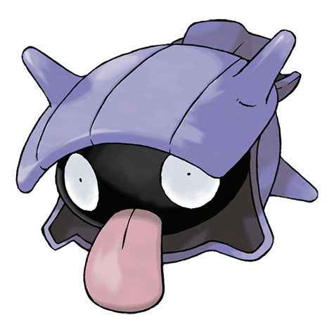

---
title: "Shellder (#0090)"
category: Pokedex
tags: [shellder, kanto, water]
image: "assets/images/pokemon/090.png"
---

# Shellder (#0090)

*Bivalve Pokemon*

**Type:** Water
**Abilities:** [[Shell Armor]], [[Skill Link]], [[Overcoat]] *(Hidden)*
**Base HP:** 3

> It lives at the bottom of the sea and rivers. It feeds on algae but it’s attracted to sweet substances. When frightened it will shut its clam and lock it to be almost impossible to open.

---

## Statistiche (Attributes & Limits)

| Attribute | Base / Limit |
|---|---|
| **Strength** | 2/4 |
| **Dexterity** | 1/3 |
| **Vitality** | 3/6 |
| **Special** | 2/4 |
| **Insight** | 1/3 |

---

## Mosse (Learnset)

- **Starter:** [[Tackle]]
- **Beginner:** [[Water_Gun]], [[Protect]], [[Supersonic]]
- **Amateur:** [[Icicle_Spear]], [[Withdraw]], [[Leer]], [[Clamp]], [[Ice_Shard]], [[Razor_Shell]], [[Aurora_Beam]], [[Whirlpool]], [[Brine]]
- **Ace:** [[Iron_Defense]], [[Ice_Beam]], [[Shell_Smash]], [[Hydro_Pump]]
- **Pro:** [[Aqua_Ring]], [[Rock_Blast]], [[Rapid_Spin]]

---

## Correlati

### Catena Evolutiva
- [[0091_Cloyster|Cloyster]]
