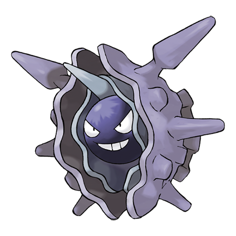

---
title: "Cloyster (#0091)"
category: Pokedex
tags: [cloyster, kanto, water, ice]
image: "assets/images/pokemon/091.png"
---

# Cloyster (#0091)

*Bivalve Pokemon*

**Type:** Water / Ice
**Abilities:** [[Shell Armor]], [[Skill Link]], [[Overcoat]] *(Hidden)*
**Base HP:** 4

> If it lives in seas with harsh currents, it will grow larger and sharper spikes on its shells than those who live on calm waters. Its shell is extremely hard - you would need explosives to try to open it.

---

## Statistiche (Attributes & Limits)

| Attribute | Base / Limit |
|---|---|
| **Strength** | 3/6 |
| **Dexterity** | 2/5 |
| **Vitality** | 4/9 |
| **Special** | 2/5 |
| **Insight** | 2/4 |

---

## Mosse (Learnset)

- **Starter:** [[Withdraw]]
- **Beginner:** [[Protect]], [[Supersonic]]
- **Amateur:** [[Spike_Cannon]], [[Aurora_Beam]], [[Toxic_Spikes]]
- **Ace:** [[Hydro_Pump]], [[Shell_Smash]], [[Spikes]], [[Icicle_Crash]]
- **Pro:** [[Aqua_Ring]], [[Rock_Blast]], [[Self_Destruct]]

---

## Correlati

### Catena Evolutiva
- [[0090_Shellder|Shellder]]
