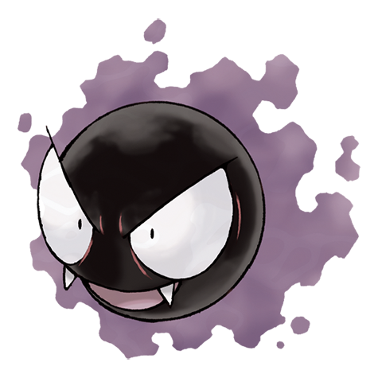

---
title: "Gastly (#0092)"
category: Pokedex
tags: [gastly, kanto, ghost, poison]
image: "assets/images/pokemon/092.png"
---

# Gastly (#0092)

*Gas Pokemon*

**Type:** Ghost / Poison
**Abilities:** [[Levitate]]
**Base HP:** 4

> Its body is made of a toxic gas - anyone would faint if engulfed by it. It has been seen in abandoned places scaring people and other pokemon for fun. It is elusive and escapes through the walls.

---

## Statistiche (Attributes & Limits)

| Attribute | Base / Limit |
|---|---|
| **Strength** | 1/3 |
| **Dexterity** | 2/5 |
| **Vitality** | 1/3 |
| **Special** | 3/6 |
| **Insight** | 1/3 |

---

## Mosse (Learnset)

- **Starter:** [[Spite]], [[Lick]]
- **Beginner:** [[Night_Shade]], [[Mean_Look]], [[Curse]]
- **Amateur:** [[Hypnosis]], [[Confuse_Ray]], [[Sucker_Punch]], [[Payback]], [[Shadow_Ball]], [[Dark_Pulse]]
- **Ace:** [[Dream_Eater]], [[Destiny_Bond]], [[Hex]], [[Nightmare]]
- **Pro:** [[Clear_Smog]], [[Icy_Wind]], [[Grudge]]

---

## Correlati

### Catena Evolutiva
- [[0093_Haunter|Haunter]]
- [[0094_Gengar|Gengar]]
