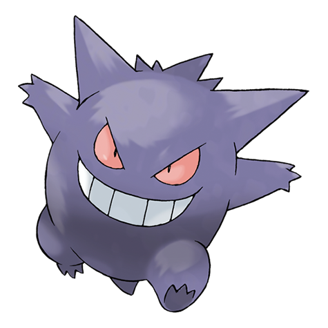
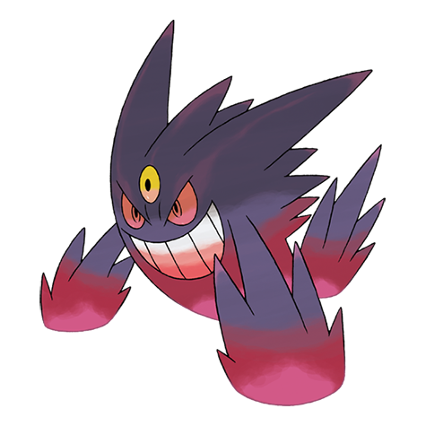
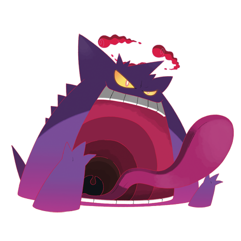

---
title: "Gengar (#0094)"
category: Pokedex
tags: [gengar, kanto, ghost, poison]
image: "assets/images/pokemon/094.png"
---

# Gengar (#0094)

*Shadow Pokemon*

**Type:** Ghost / Poison
**Abilities:** [[Cursed Body]]
**Base HP:** 5

> This Pokemon is mischievous but it can be downright evil. It takes joy in casting curses upon innocents and eating the life of people and Pokemon. It lurks in the shadows and disguises itself as one.

---

## Statistiche (Attributes & Limits)

| Attribute | Base / Limit |
|---|---|
| **Strength** | 2/4 |
| **Dexterity** | 3/6 |
| **Vitality** | 2/4 |
| **Special** | 3/7 |
| **Insight** | 2/5 |

---

## Mosse (Learnset)

- **Starter:** [[Spite]], [[Lick]]
- **Beginner:** [[Curse]], [[Mean_Look]], [[Night_Shade]]
- **Amateur:** [[Hypnosis]], [[Confuse_Ray]], [[Sucker_Punch]], [[Shadow_Punch]], [[Payback]], [[Shadow_Ball]], [[Dark_Pulse]]
- **Ace:** [[Dream_Eater]], [[Destiny_Bond]], [[Hex]], [[Nightmare]]
- **Pro:** [[Perish_Song]], [[Icy_Wind]], [[Giga_Drain]]

---

## Forme Speciali

<strong>Mega Gengar</strong>

<strong>Gengar (Gigantamax)</strong>

---

## Correlati

### Catena Evolutiva
- [[0092_Gastly|Gastly]]
- [[0093_Haunter|Haunter]]
