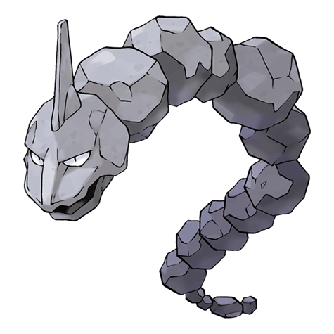

---
title: "Onix (#0095)"
category: Pokedex
tags: [onix, kanto, rock, ground]
image: "assets/images/pokemon/095.png"
---

# Onix (#0095)

*Rock Snake Pokemon*

**Type:** Rock / Ground
**Abilities:** [[Rock Head]], [[Sturdy]], [[Weak Armor]] *(Hidden)*
**Base HP:** 8

> It is not full-size when it’s born. Years of eating boulders make it a real giant. It lives on mountains and dark tunnels. Its frightening roars travel as echo through the cave. It is very aggressive towards others.

---

## Statistiche (Attributes & Limits)

| Attribute | Base / Limit |
|---|---|
| **Strength** | 2/4 |
| **Dexterity** | 2/5 |
| **Vitality** | 4/8 |
| **Special** | 1/3 |
| **Insight** | 2/4 |

---

## Mosse (Learnset)

- **Starter:** [[Tackle]], [[Harden]], [[Mud_Sport]]
- **Beginner:** [[Bind]], [[Curse]], [[Rock_Throw]]
- **Amateur:** [[Rock_Tomb]], [[Rage]], [[Stealth_Rock]], [[Rock_Polish]], [[Smack_Down]], [[Dragon_Breath]], [[Slam]], [[Screech]], [[Rock_Slide]], [[Sand_Tomb]], [[Dig]]
- **Ace:** [[Iron_Tail]], [[Stone_Edge]], [[Double-Edge]], [[Sandstorm]]
- **Pro:** [[Ancient_Power]], [[Self_Destruct]], [[Endure]]

