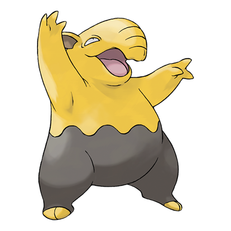

---
title: "Drowzee (#0096)"
category: Pokedex
tags: [drowzee, kanto, psychic]
image: "assets/images/pokemon/096.png"
---

# Drowzee (#0096)

*Hypnosis Pokemon*

**Type:** Psychic
**Abilities:** [[Insomnia]], [[Forewarn]], [[Inner Focus]] *(Hidden)*
**Base HP:** 3

> It eats the dreams of a sleeping person or Pokemon and shows fondness to the dreams of young children. Once the victim is deep in slumber it will extract and eat the dream through the nose.

---

## Statistiche (Attributes & Limits)

| Attribute | Base / Limit |
|---|---|
| **Strength** | 2/4 |
| **Dexterity** | 1/3 |
| **Vitality** | 2/4 |
| **Special** | 1/3 |
| **Insight** | 2/5 |

---

## Mosse (Learnset)

- **Starter:** [[Pound]], [[Hypnosis]]
- **Beginner:** [[Disable]], [[Poison_Gas]], [[Meditate]]
- **Amateur:** [[Psybeam]], [[Headbutt]], [[Psych_Up]], [[Synchronoise]], [[Zen_Headbutt]], [[Swagger]]
- **Ace:** [[Psychic]], [[Nasty_Plot]], [[Psyshock]], [[Future_Sight]]
- **Pro:** [[Role_Play]], [[Thunder_Wave]], [[Substitute]]

---

## Correlati

### Catena Evolutiva
- [[0097_Hypno|Hypno]]
