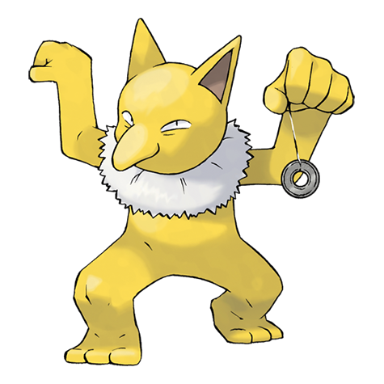

---
title: "Hypno (#0097)"
category: Pokedex
tags: [hypno, kanto, psychic]
image: "assets/images/pokemon/097.png"
---

# Hypno (#0097)

*Hypnosis Pokemon*

**Type:** Psychic
**Abilities:** [[Insomnia]], [[Forewarn]], [[Inner Focus]] *(Hidden)*
**Base HP:** 4

> Old children stories tell of an Hypno who takes away naughty kids and feasts on their dreams until they are old men. They have an urge to eat the dreams of others since they cannot sleep themselves.

---

## Statistiche (Attributes & Limits)

| Attribute | Base / Limit |
|---|---|
| **Strength** | 2/5 |
| **Dexterity** | 2/4 |
| **Vitality** | 2/5 |
| **Special** | 2/5 |
| **Insight** | 3/6 |

---

## Mosse (Learnset)

- **Starter:** [[Hypnosis]], [[Pound]]
- **Beginner:** [[Confusion]], [[Disable]], [[Poison_Gas]], [[Meditate]]
- **Amateur:** [[Nightmare]], [[Headbutt]], [[Switcheroo]], [[Swagger]], [[Psybeam]], [[Headbutt]], [[Psych_Up]], [[Synchronoise]], [[Zen_Headbutt]]
- **Ace:** [[Nasty_Plot]], [[Psychic]], [[Psyshock]], [[Future_Sight]]
- **Pro:** [[Thunder_Wave]], [[Substitute]], [[Metronome]]

---

## Correlati

### Catena Evolutiva
- [[0096_Drowzee|Drowzee]]
