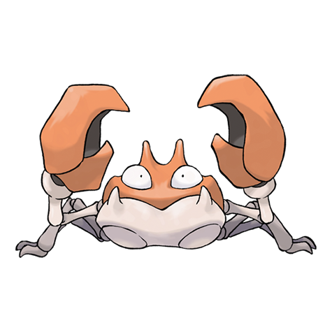

---
title: "Krabby (#0098)"
category: Pokedex
tags: [krabby, kanto, water]
image: "assets/images/pokemon/098.png"
---

# Krabby (#0098)

*River Crab Pokemon*

**Type:** Water
**Abilities:** [[Hyper Cutter]], [[Shell Armor]], [[Sheer Force]] *(Hidden)*
**Base HP:** 3

> A Krabby dig holes in the sand near the sea. They can be seen squabbling with each other over food and territory. They usually avoid humans but will fight if provoked.

---

## Statistiche (Attributes & Limits)

| Attribute | Base / Limit |
|---|---|
| **Strength** | 3/6 |
| **Dexterity** | 2/4 |
| **Vitality** | 2/5 |
| **Special** | 1/3 |
| **Insight** | 1/3 |

---

## Mosse (Learnset)

- **Starter:** [[Bubble]], [[Mud_Sport]]
- **Beginner:** [[Vice_Grip]], [[Leer]], [[Harden]]
- **Amateur:** [[Bubble_Beam]], [[Mud_Shot]], [[Metal_Claw]], [[Stomp]], [[Protect]], [[Slam]]
- **Ace:** [[Guillotine]], [[Brine]], [[Crabhammer]], [[Flail]]
- **Pro:** [[Agility]], [[Iron_Defense]], [[Mimic]]

---

## Correlati

### Catena Evolutiva
- [[0099_Kingler|Kingler]]
