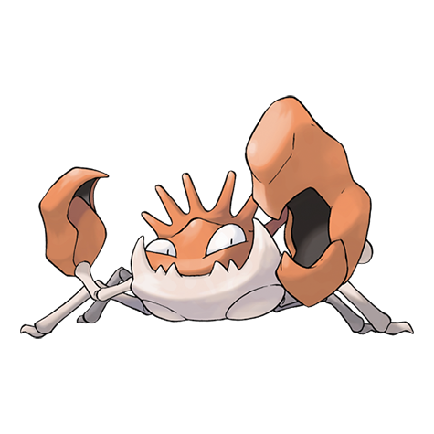
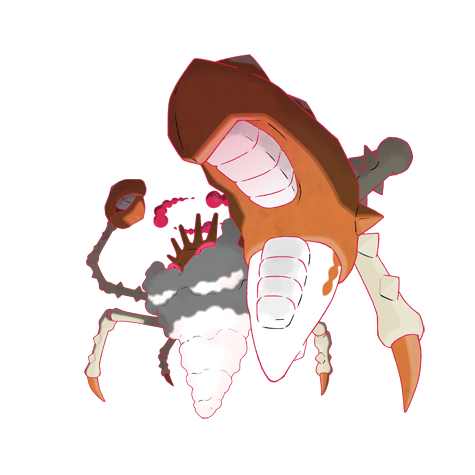

---
title: "Kingler (#0099)"
category: Pokedex
tags: [kingler, kanto, water]
image: "assets/images/pokemon/099.png"
---

# Kingler (#0099)

*Pincer Pokemon*

**Type:** Water
**Abilities:** [[Hyper Cutter]], [[Shell Armor]], [[Sheer Force]] *(Hidden)*
**Base HP:** 4

> Its pincers grow peculiarly large. If it lifts the pincers too fast, it may lose its balance and stagger. If one of its pincers is damaged, it will detach it from its body. It will regrow after a few days..

---

## Statistiche (Attributes & Limits)

| Attribute | Base / Limit |
|---|---|
| **Strength** | 3/7 |
| **Dexterity** | 2/5 |
| **Vitality** | 3/6 |
| **Special** | 2/4 |
| **Insight** | 2/4 |

---

## Mosse (Learnset)

- **Starter:** [[Mud_Sport]], [[Bubble]]
- **Beginner:** [[Leer]], [[Vice_Grip]], [[Harden]]
- **Amateur:** [[Wide_Guard]], [[Bubble_Beam]], [[Mud_Shot]], [[Metal_Claw]], [[Stomp]], [[Protect]], [[Slam]]
- **Ace:** [[Guillotine]], [[Brine]], [[Crabhammer]], [[Flail]]
- **Pro:** [[Agility]], [[Iron_Defense]], [[Mimic]]

---

## Forme Speciali

<strong>Kingler (Gigantamax)</strong>

---

## Correlati

### Catena Evolutiva
- [[0098_Krabby|Krabby]]
