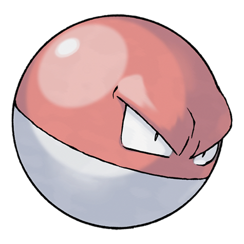

---
title: "Voltorb (#0100)"
category: Pokedex
tags: [voltorb, kanto, electric]
image: "assets/images/pokemon/100.png"
---

# Voltorb (#0100)

*Ball Pokemon*

**Type:** Electric
**Abilities:** [[Soundproof]], [[Static]], [[Aftermath]] *(Hidden)*
**Base HP:** 3

> They live near factories and electric generators. It bears an uncanny and unexplained resemblance to a Pokeball. Since it explodes at the slightest provocation, even veteran trainers treat it with caution.

---

## Statistiche (Attributes & Limits)

| Attribute | Base / Limit |
|---|---|
| **Strength** | 1/3 |
| **Dexterity** | 3/6 |
| **Vitality** | 2/4 |
| **Special** | 2/4 |
| **Insight** | 2/4 |

---

## Mosse (Learnset)

- **Starter:** [[Charge]], [[Tackle]]
- **Beginner:** [[Sonic_Boom]], [[Eerie_Impulse]], [[Spark]]
- **Amateur:** [[Rollout]], [[Screech]], [[Charge_Beam]], [[Light_Screen]], [[Electro_Ball]], [[Self_Destruct]], [[Swift]], [[Discharge]]
- **Ace:** [[Magnet_Rise]], [[Gyro_Ball]], [[Explosion]], [[Mirror_Coat]]
- **Pro:** [[Endure]], [[Sucker_Punch]], [[Foul_Play]]

---

## Correlati

### Catena Evolutiva
- [[0101_Electrode|Electrode]]
