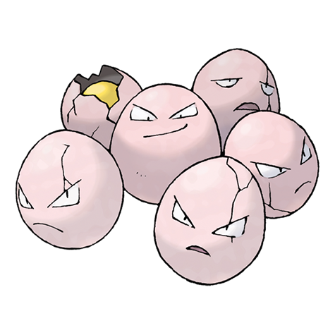

---
title: "Exeggcute (#0102)"
category: Pokedex
tags: [exeggcute, kanto, grass, psychic]
image: "assets/images/pokemon/102.png"
---

# Exeggcute (#0102)

*Egg Pokemon*

**Type:** Grass / Psychic
**Abilities:** [[Chlorophyll]], [[Harvest]] *(Hidden)*
**Base HP:** 3

> Even though it appears to be eggs of some sort, it is related more to a seed. It gathers in packs of six that have a mental link with each other. Each one of them has a different personality.

---

## Statistiche (Attributes & Limits)

| Attribute | Base / Limit |
|---|---|
| **Strength** | 1/3 |
| **Dexterity** | 1/3 |
| **Vitality** | 2/5 |
| **Special** | 2/4 |
| **Insight** | 2/4 |

---

## Mosse (Learnset)

- **Starter:** [[Barrage]], [[Uproar]]
- **Beginner:** [[Hypnosis]], [[Reflect]]
- **Amateur:** [[Leech_Seed]], [[Bullet_Seed]], [[Stun_Spore]], [[Poison_Powder]], [[Sleep_Powder]], [[Confusion]], [[Worry_Seed]]
- **Ace:** [[Natural_Gift]], [[Solar_Beam]], [[Extrasensory]], [[Bestow]]
- **Pro:** [[Nightmare]], [[Ingrain]], [[Curse]]

---

## Correlati

### Catena Evolutiva
- [[0103_Exeggutor|Exeggutor]]
