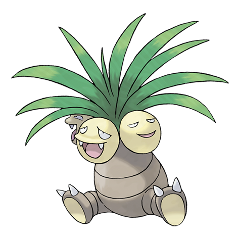

---
title: "Exeggutor (#0103)"
category: Pokedex
tags: [exeggutor, kanto, grass, psychic]
image: "assets/images/pokemon/103.png"
---

# Exeggutor (#0103)

*Coconut Pokemon*

**Type:** Grass / Psychic
**Abilities:** [[Chlorophyll]], [[Harvest]] *(Hidden)*
**Base HP:** 5

> Originally from tropical areas. Exeggutor's heads grow larger with strong sunlight. Each head thinks independently. They are friendly and provide their shade to other Pokemon.

---

## Statistiche (Attributes & Limits)

| Attribute | Base / Limit |
|---|---|
| **Strength** | 3/6 |
| **Dexterity** | 2/4 |
| **Vitality** | 2/5 |
| **Special** | 3/7 |
| **Insight** | 2/5 |

---

## Mosse (Learnset)

- **Starter:** [[Barrage]]
- **Beginner:** [[Confusion]], [[Hypnosis]]
- **Amateur:** [[Seed_Bomb]], [[Stomp]], [[Psyshock]], [[Egg_Bomb]]
- **Ace:** [[Wood_Hammer]], [[Leaf_Storm]]
- **Pro:** [[Nightmare]], [[Grassy_Terrain]], [[Curse]]

---

## Correlati

### Catena Evolutiva
- [[0102_Exeggcute|Exeggcute]]
