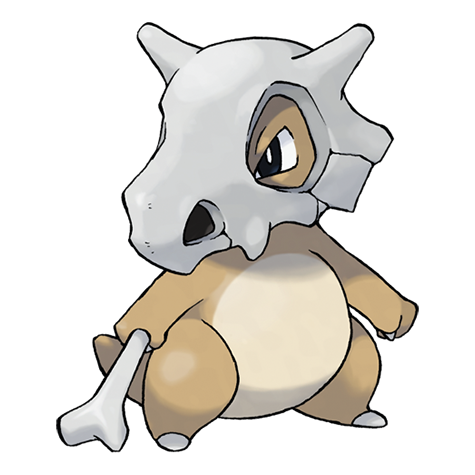

---
title: "Cubone (#0104)"
category: Pokedex
tags: [cubone, kanto, ground]
image: "assets/images/pokemon/104.png"
---

# Cubone (#0104)

*Lonely Pokemon*

**Type:** Ground
**Abilities:** [[Rock Head]], [[Lightning Rod]], [[Battle Armor]] *(Hidden)*
**Base HP:** 3

> Cubone wears a skull helmet it never removes. It is said to be from its mother or someone dear to it. Lives in the mountains where it cries at night due to the sadness it feels. It is distrustful of humans.

---

## Statistiche (Attributes & Limits)

| Attribute | Base / Limit |
|---|---|
| **Strength** | 2/4 |
| **Dexterity** | 1/3 |
| **Vitality** | 3/6 |
| **Special** | 2/4 |
| **Insight** | 2/4 |

---

## Mosse (Learnset)

- **Starter:** [[Growl]], [[Tail_Whip]]
- **Beginner:** [[Bone_Club]], [[Focus_Energy]], [[Leer]]
- **Amateur:** [[Headbutt]], [[Bonemerang]], [[Rage]], [[False_Swipe]], [[Endeavor]], [[Fling]]
- **Ace:** [[Bone_Rush]], [[Stomping_Tantrum]], [[Thrash]], [[Double-Edge]], [[Retaliate]]
- **Pro:** [[Iron_Defense]], [[Double_Kick]], [[Detect]]

---

## Correlati

### Catena Evolutiva
- [[0105_Marowak|Marowak]]
