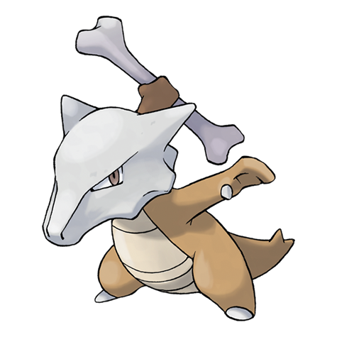

# Marowak (Alolan Form) (#0105A)

*Bone Keeper Pokemon*

**Type:** Fuoco / Spettro
**Abilities:** [[Cursed Body]], [[Lightning Rod]], [[Rock Head]] *(Hidden)*
**Base HP:** 4

> Alola has many predators for an orphaned Cubone, so its mother’s spirit lingered close to protect her baby. This otherworldly influence made Marowak fiercer and changed its type completely.

---

## Statistiche (Attributes & Limits)

| Attribute | Base / Limit |
|---|---|
| **Strength** | 2/5 |
| **Dexterity** | 2/4 |
| **Vitality** | 3/6 |
| **Special** | 2/4 |
| **Insight** | 2/5 |

---

## Mosse (Learnset)

- **Starter:** [[Growl|Growl]], [[Tail_Whip|Tail Whip]]
- **Beginner:** [[Bone_Club|Bone Club]], [[Hex|Hex]], [[Leer|Leer]]
- **Amateur:** [[Flame_Wheel|Flame Wheel]], [[Bonemerang|Bonemerang]], [[Will_O_Wisp|Will-O-Wisp]], [[Shadow_Bone|Shadow Bone]], [[Endeavor|Endeavor]], [[Fling|Fling]]
- **Ace:** [[Stomping_Tantrum|Stomping Tantrum]], [[Thrash|Thrash]], [[Flare_Blitz|Flare Blitz]], [[Retaliate|Retaliate]], [[Bone_Rush|Bone Rush]]
- **Pro:** [[Perish_Song|Perish Song]], [[Brutal_Swing|Brutal Swing]], [[Flame_Charge|Flame Charge]]

---
