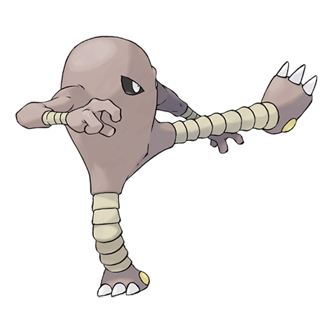

---
title: "Hitmonlee (#0106)"
category: Pokedex
tags: [hitmonlee, kanto, fighting]
image: "assets/images/pokemon/106.png"
---

# Hitmonlee (#0106)

*Kicking Pokemon*

**Type:** Fighting
**Abilities:** [[Limber]], [[Reckless]], [[Unburden]] *(Hidden)*
**Base HP:** 4

> Kicking Pokemon Its legs freely stretch and contract. It bowls over foes with devastating kicks. It is very disciplined and trains every day. It is very rare in the wild, and it is mostly found in urban areas

---

## Statistiche (Attributes & Limits)

| Attribute | Base / Limit |
|---|---|
| **Strength** | 3/7 |
| **Dexterity** | 2/5 |
| **Vitality** | 2/4 |
| **Special** | 1/3 |
| **Insight** | 3/6 |

---

## Mosse (Learnset)

- **Starter:** [[Double_Kick]], [[Revenge]]
- **Beginner:** [[Meditate]], [[Rolling_Kick]], [[Jump_Kick]]
- **Amateur:** [[Brick_Break]], [[Focus_Energy]], [[Feint]], [[High_Jump_Kick]], [[Mind_Reader]], [[Foresight]], [[Wide_Guard]], [[Blaze_Kick]]
- **Ace:** [[Endure]], [[Mega_Kick]], [[Close_Combat]], [[Reversal]]
- **Pro:** [[Bounce]], [[Rapid_Spin]], [[Mach_Punch]]

