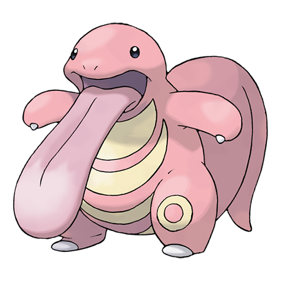

---
title: "Lickitung (#0108)"
category: Pokedex
tags: [lickitung, kanto, normal]
image: "assets/images/pokemon/108.png"
---

# Lickitung (#0108)

*Licking Pokemon*

**Type:** Normal
**Abilities:** [[Own Tempo]], [[Oblivious]], [[Cloud Nine]] *(Hidden)*
**Base HP:** 3

> Its tongue is twice as long as its body and it is used for everything, from capturing prey to feeling it’s surroundings and cleaning itself. It really dislikes sour and bitter flavors.

---

## Statistiche (Attributes & Limits)

| Attribute | Base / Limit |
|---|---|
| **Strength** | 2/4 |
| **Dexterity** | 1/3 |
| **Vitality** | 2/5 |
| **Special** | 2/4 |
| **Insight** | 2/5 |

---

## Mosse (Learnset)

- **Starter:** [[Lick]], [[Supersonic]]
- **Beginner:** [[Defense_Curl]], [[Knock_Off]]
- **Amateur:** [[Wrap]], [[Stomp]], [[Disable]], [[Slam]], [[Rollout]], [[Chip_Away]], [[Me_First]]
- **Ace:** [[Refresh]], [[Screech]], [[Power_Whip]], [[Wring_Out]]
- **Pro:** [[Belly_Drum]], [[Aqua_Tail]], [[Zen_Headbutt]]

