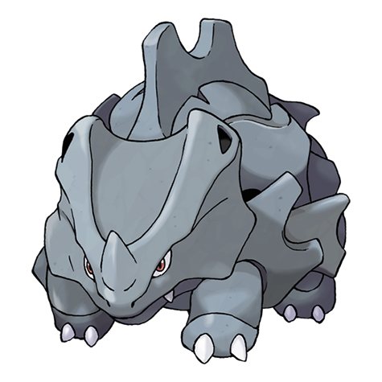

---
title: "Rhyhorn (#0111)"
category: Pokedex
tags: [rhyhorn, kanto, ground, rock]
image: "assets/images/pokemon/111.png"
---

# Rhyhorn (#0111)

*Spikes Pokemon*

**Type:** Ground / Rock
**Abilities:** [[Lightning Rod]], [[Rock Head]], [[Reckless]] *(Hidden)*
**Base HP:** 3

> It lives in grasslands and rough terrains. It is covered with a thick hide and it tramples any threats by running towards them. It is not very smart, though. It can keep trampling things for hours just because.

---

## Statistiche (Attributes & Limits)

| Attribute | Base / Limit |
|---|---|
| **Strength** | 2/5 |
| **Dexterity** | 1/3 |
| **Vitality** | 3/6 |
| **Special** | 1/3 |
| **Insight** | 1/3 |

---

## Mosse (Learnset)

- **Starter:** [[Horn_Attack]], [[Tail_Whip]]
- **Beginner:** [[Stomp]], [[Fury_Attack]], [[Smack_Down]]
- **Amateur:** [[Scary_Face]], [[Rock_Blast]], [[Bulldoze]], [[Chip_Away]], [[Take_Down]], [[Drill_Run]]
- **Ace:** [[Stone_Edge]], [[Earthquake]], [[Horn_Drill]], [[Megahorn]]
- **Pro:** [[Thunder_Fang]], [[Ice_Fang]], [[Fire_Fang]]

---

## Correlati

### Catena Evolutiva
- [[0112_Rhydon|Rhydon]]
