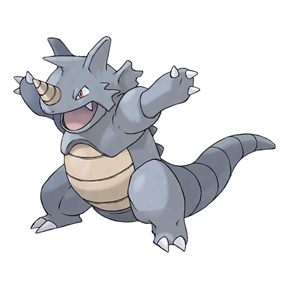

---
title: "Rhydon (#0112)"
category: Pokedex
tags: [rhydon, kanto, ground, rock]
image: "assets/images/pokemon/112.png"
---

# Rhydon (#0112)

*Drill Pokemon*

**Type:** Ground / Rock
**Abilities:** [[Lightning Rod]], [[Rock Head]], [[Reckless]] *(Hidden)*
**Base HP:** 5

> It has a horn that serves as a drill for destroying rocks and boulders. Rhydon occasionally goes for a swim in rivers and even magma pools. Its great resistance prevents it from taking any damage.

---

## Statistiche (Attributes & Limits)

| Attribute | Base / Limit |
|---|---|
| **Strength** | 3/7 |
| **Dexterity** | 1/3 |
| **Vitality** | 3/7 |
| **Special** | 2/4 |
| **Insight** | 2/4 |

---

## Mosse (Learnset)

- **Starter:** [[Horn_Attack]], [[Tail_Whip]]
- **Beginner:** [[Stomp]], [[Fury_Attack]], [[Smack_Down]]
- **Amateur:** [[Scary_Face]], [[Rock_Blast]], [[Bulldoze]], [[Chip_Away]], [[Take_Down]], [[Drill_Run]]
- **Ace:** [[Hammer_Arm]], [[Stone_Edge]], [[Earthquake]], [[Horn_Drill]], [[Megahorn]]
- **Pro:** [[Dragon_Rush]], [[Skull_Bash]], [[Smart_Strike]]

---

## Correlati

### Catena Evolutiva
- [[0111_Rhyhorn|Rhyhorn]]
