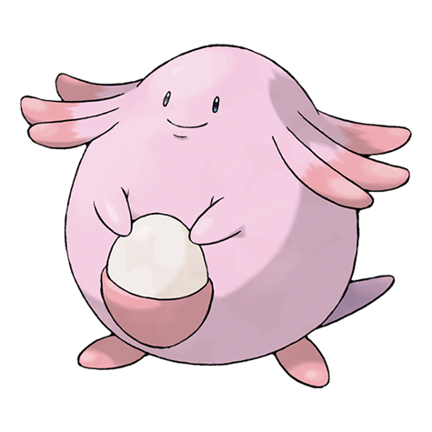

---
title: "Chansey (#0113)"
category: Pokedex
tags: [chansey, kanto, normal]
image: "assets/images/pokemon/113.png"
---

# Chansey (#0113)

*Egg Pokemon*

**Type:** Normal
**Abilities:** [[Natural Cure]], [[Serene Grace]], [[Healer]] *(Hidden)*
**Base HP:** 12

> There are only females in this species. Chansey lays a nutritive egg every day. These eggs are fed to the sick to give them strength. It is a loving and smart Pokemon, but it’s pretty rare and elusive in the wild.

---

## Statistiche (Attributes & Limits)

| Attribute | Base / Limit |
|---|---|
| **Strength** | 1/2 |
| **Dexterity** | 2/4 |
| **Vitality** | 1/2 |
| **Special** | 1/3 |
| **Insight** | 3/6 |

---

## Mosse (Learnset)

- **Starter:** [[Pound]], [[Defense_Curl]]
- **Beginner:** [[Refresh]], [[Growl]], [[Soft_Boiled]], [[Double_Slap]]
- **Amateur:** [[Heal_Pulse]], [[Bestow]], [[Minimize]], [[Take_Down]], [[Sing]]
- **Ace:** [[Fling]], [[Double-Edge]], [[Egg_Bomb]], [[Light_Screen]], [[Healing_Wish]]
- **Pro:** [[Heal_Bell]], [[Seismic_Toss]], [[Present]]

