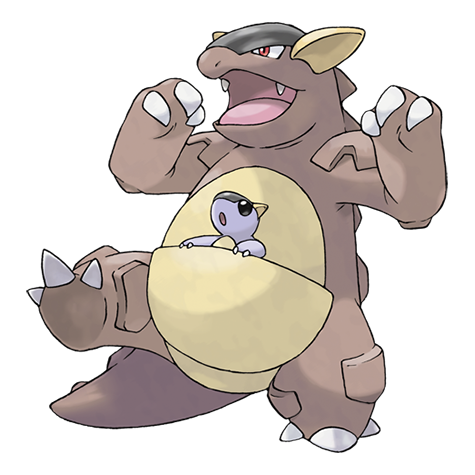

# Kangaskhan (Mega Form) (#0115M1)

*Parent Pokemon*

**Type:** Normale
**Abilities:** [[Parental Bond]]
**Base HP:** 6

> The mother gives all the power of the Mega Stone to her child. The child grows violent and both team up as formidable fighters. But the mother worries about her child’s future as she raised it better than that.

---

## Statistiche (Attributes & Limits)

| Attribute | Base / Limit |
|---|---|
| **Strength** | 3/7 |
| **Dexterity** | 3/6 |
| **Vitality** | 3/6 |
| **Special** | 2/4 |
| **Insight** | 3/6 |

---

## Mosse (Learnset)

- **Starter:** [[Comet_Punch|Comet Punch]], [[Leer|Leer]]
- **Beginner:** [[Fake_Out|Fake Out]], [[Tail_Whip|Tail Whip]], [[Bite|Bite]]
- **Amateur:** [[Double_Hit|Double Hit]], [[Rage|Rage]], [[Mega_Punch|Mega Punch]], [[Chip_Away|Chip Away]], [[Dizzy_Punch|Dizzy Punch]], [[Crunch|Crunch]]
- **Ace:** [[Endure|Endure]], [[Outrage|Outrage]], [[Sucker_Punch|Sucker Punch]], [[Reversal|Reversal]]
- **Pro:** [[Aqua_Tail|Aqua Tail]], [[Captivate|Captivate]], [[Counter|Counter]]

---
