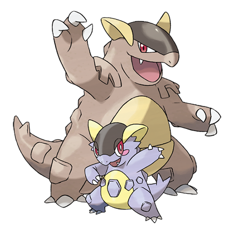

---
title: "Kangaskhan (#0115)"
category: Pokedex
tags: [kangaskhan, kanto, normal]
image: "assets/images/pokemon/115.png"
---

# Kangaskhan (#0115)

*Parent Pokemon*

**Type:** Normal
**Abilities:** [[Early Bird]], [[Scrappy]], [[Inner Focus]] *(Hidden)*
**Base HP:** 5

> A female only species. It raises its offspring in its belly pouch. The young leaves once it learns to find its own food. In the wild, mothers and daughters fiercely defend each other.

---

## Statistiche (Attributes & Limits)

| Attribute | Base / Limit |
|---|---|
| **Strength** | 3/6 |
| **Dexterity** | 2/5 |
| **Vitality** | 2/5 |
| **Special** | 1/3 |
| **Insight** | 2/5 |

---

## Mosse (Learnset)

- **Starter:** [[Comet_Punch]], [[Leer]]
- **Beginner:** [[Fake_Out]], [[Tail_Whip]], [[Bite]]
- **Amateur:** [[Double_Hit]], [[Rage]], [[Mega_Punch]], [[Chip_Away]], [[Dizzy_Punch]], [[Crunch]]
- **Ace:** [[Endure]], [[Outrage]], [[Sucker_Punch]], [[Reversal]]
- **Pro:** [[Aqua_Tail]], [[Captivate]], [[Counter]]

---

## Forme Speciali

### Mega Kangaskhan

**Type:** Normal  
**Ability:** [[Parental_Bond|Parental Bond]]  
**Base HP:** 6  ·  **Suggested Rank:** Ace  
**Height:** 2.2m / 7'03"  ·  **Weight:** 160kg / 352lbs

> The mother gives all the power of the Mega Stone to her child. The child grows violent and both team up as formidable fighters. But the mother worries about her child's future as she raised it better than that.

 
