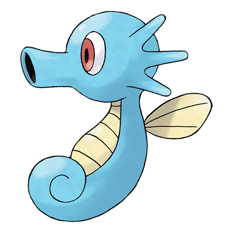

---
title: "Horsea (#0116)"
category: Pokedex
tags: [horsea, kanto, water]
image: "assets/images/pokemon/116.png"
---

# Horsea (#0116)

*Dragon Pokemon*

**Type:** Water
**Abilities:** [[Swift Swim]], [[Sniper]], [[Damp]] *(Hidden)*
**Base HP:** 3

> It makes its nest in the shade of corals in shallow parts of the sea. If it senses danger, it spits a murky ink and flees. It has been seen shooting down flying bugs to eat them.

---

## Statistiche (Attributes & Limits)

| Attribute | Base / Limit |
|---|---|
| **Strength** | 2/4 |
| **Dexterity** | 2/4 |
| **Vitality** | 2/5 |
| **Special** | 2/5 |
| **Insight** | 1/3 |

---

## Mosse (Learnset)

- **Starter:** [[Water_Gun]], [[Smokescreen]]
- **Beginner:** [[Leer]], [[Bubble]], [[Focus_Energy]]
- **Amateur:** [[Bubble_Beam]], [[Agility]], [[Twister]], [[Brine]]
- **Ace:** [[Hydro_Pump]], [[Dragon_Dance]], [[Dragon_Pulse]]
- **Pro:** [[Aurora_Beam]], [[Signal_Beam]], [[Octazooka]]

---

## Correlati

### Catena Evolutiva
- [[0117_Seadra|Seadra]]
