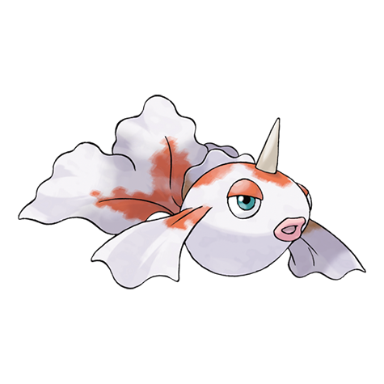

---
title: "Goldeen (#0118)"
category: Pokedex
tags: [goldeen, kanto, water]
image: "assets/images/pokemon/118.png"
---

# Goldeen (#0118)

*Goldfish Pokemon*

**Type:** Water
**Abilities:** [[Swift Swim]], [[Water Veil]], [[Lightning Rod]] *(Hidden)*
**Base HP:** 3

> Goldeen loves swimming wild and free in rivers and ponds. If one of these Pokemon is placed in an aquarium, it will shatter the glass with its horn and make its escape.

---

## Statistiche (Attributes & Limits)

| Attribute | Base / Limit |
|---|---|
| **Strength** | 2/4 |
| **Dexterity** | 2/4 |
| **Vitality** | 2/4 |
| **Special** | 1/3 |
| **Insight** | 2/4 |

---

## Mosse (Learnset)

- **Starter:** [[Peck]], [[Water_Sport]]
- **Beginner:** [[Supersonic]], [[Horn_Attack]], [[Water_Pulse]]
- **Amateur:** [[Flail]], [[Aqua_Ring]], [[Fury_Attack]], [[Waterfall]]
- **Ace:** [[Horn_Drill]], [[Agility]], [[Soak]], [[Megahorn]]
- **Pro:** [[Bounce]], [[Mud_Sport]], [[Drill_Run]]

---

## Correlati

### Catena Evolutiva
- [[0119_Seaking|Seaking]]
