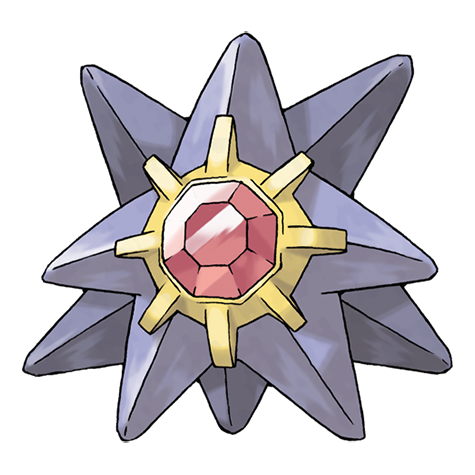

---
title: "Starmie (#0121)"
category: Pokedex
tags: [starmie, kanto, water, psychic]
image: "assets/images/pokemon/121.png"
---

# Starmie (#0121)

*Mysterious Pokemon*

**Type:** Water / Psychic
**Abilities:** [[Illuminate]], [[Natural Cure]], [[Analytic]] *(Hidden)*
**Base HP:** 4

> This Pokemon has been given the nickname “the gem of the sea.” It swims through water by spinning its star-shaped body as if it were a propeller on a ship. The core at the center glows with different colors.

---

## Statistiche (Attributes & Limits)

| Attribute | Base / Limit |
|---|---|
| **Strength** | 2/5 |
| **Dexterity** | 3/6 |
| **Vitality** | 2/5 |
| **Special** | 3/6 |
| **Insight** | 2/5 |

---

## Mosse (Learnset)

- **Starter:** [[Spotlight]]
- **Beginner:** [[Water_Gun]], [[Recover]]
- **Amateur:** [[Swift]], [[Rapid_Spin]]
- **Ace:** [[Confuse_Ray]], [[Hydro_Pump]]
- **Pro:** [[Signal_Beam]], [[Thunder_Wave]], [[Twister]]

---

## Correlati

### Catena Evolutiva
- [[0120_Staryu|Staryu]]
