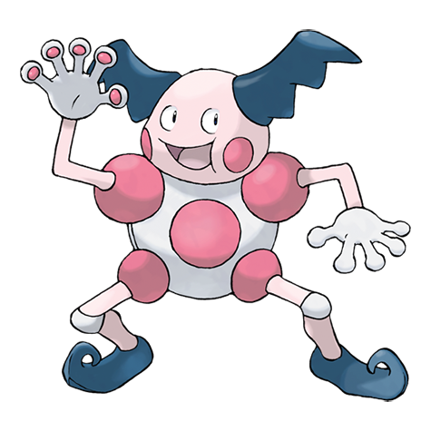

---
title: "Mr. Mime (#0122)"
category: Pokedex
tags: [mr.mime, kanto, psychic, fairy]
image: "assets/images/pokemon/122.png"
---

# Mr. Mime (#0122)

*Barrier Pokemon*

**Type:** Psychic / Fairy
**Abilities:** [[Soundproof]], [[Filter]], [[Technician]] *(Hidden)*
**Base HP:** 4

> You don’t find this Pokemon, it finds you. It is really smart and amuses itself by showing people its power to create barriers with pantomime. It creates an invisible box and flees when you try to figure out the exit.

---

## Statistiche (Attributes & Limits)

| Attribute | Base / Limit |
|---|---|
| **Strength** | 2/4 |
| **Dexterity** | 2/5 |
| **Vitality** | 2/4 |
| **Special** | 3/6 |
| **Insight** | 3/7 |

---

## Mosse (Learnset)

- **Starter:** [[Barrier]], [[Confusion]]
- **Beginner:** [[Quick_Guard]], [[Wide_Guard]], [[Magical_Leaf]], [[Trick]]
- **Amateur:** [[Power_Swap]], [[Guard_Swap]], [[Copycat]], [[Meditate]], [[Double_Slap]], [[Mimic]], [[Psywave]], [[Encore]], [[Light_Screen]], [[Reflect]], [[Psybeam]], [[Substitute]]
- **Ace:** [[Recycle]], [[Misty_Terrain]], [[Psychic]], [[Role_Play]], [[Baton_Pass]], [[Safeguard]]
- **Pro:** [[Confuse_Ray]], [[Fake_Out]], [[Nasty_Plot]]

