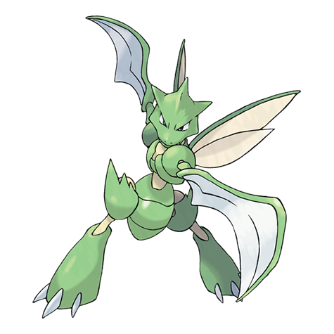

---
title: "Scyther (#0123)"
category: Pokedex
tags: [scyther, kanto, bug, flying]
image: "assets/images/pokemon/123.png"
---

# Scyther (#0123)

*Mantis Pokemon*

**Type:** Bug / Flying
**Abilities:** [[Swarm]], [[Technician]], [[Steadfast]] *(Hidden)*
**Base HP:** 3

> It’s pretty rare but a few swarms have been seen in the grasslands. It tears and shreds prey with its wickedly sharp scythes and very rarely spreads its wings to fly. This pokemon is stealthy and aggressive.

---

## Statistiche (Attributes & Limits)

| Attribute | Base / Limit |
|---|---|
| **Strength** | 3/6 |
| **Dexterity** | 3/6 |
| **Vitality** | 2/5 |
| **Special** | 2/4 |
| **Insight** | 2/5 |

---

## Mosse (Learnset)

- **Starter:** [[Quick_Attack]], [[Leer]]
- **Beginner:** [[Vacuum_Wave]], [[Focus_Energy]], [[False_Swipe]]
- **Amateur:** [[Pursuit]], [[Agility]], [[Wing_Attack]], [[Fury_Cutter]], [[Slash]], [[Razor_Wind]], [[Double_Team]], [[Double_Hit]]
- **Ace:** [[Night_Slash]], [[X-Scissor]], [[Air_Slash]], [[Swords_Dance]]
- **Pro:** [[Feint]], [[Tailwind]], [[Steel_Wing]]

