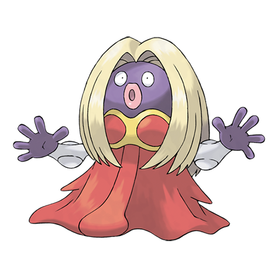

---
title: "Jynx (#0124)"
category: Pokedex
tags: [jynx, kanto, ice, psychic]
image: "assets/images/pokemon/124.png"
---

# Jynx (#0124)

*Humanshape Pokemon*

**Type:** Ice / Psychic
**Abilities:** [[Oblivious]], [[Forewarn]], [[Dry Skin]] *(Hidden)*
**Base HP:** 4

> It is not common outside cold areas. This Pokemon is female only. Its cries sound like human speech. However, it is impossible to tell what it is trying to say. The way it moves and talks induce others to dance.

---

## Statistiche (Attributes & Limits)

| Attribute | Base / Limit |
|---|---|
| **Strength** | 2/4 |
| **Dexterity** | 3/6 |
| **Vitality** | 1/3 |
| **Special** | 3/6 |
| **Insight** | 3/6 |

---

## Mosse (Learnset)

- **Starter:** [[Pound]], [[Lick]]
- **Beginner:** [[Lovely_Kiss]], [[Powder_Snow]], [[Draining_Kiss]]
- **Amateur:** [[Body_Slam]], [[Double_Slap]], [[Ice_Punch]], [[Heart_Stamp]], [[Mean_Look]], [[Fake_Tears]], [[Wake-Up_Slap]]
- **Ace:** [[Avalanche]], [[Perish_Song]], [[Wring_Out]], [[Blizzard]]
- **Pro:** [[Fake_Out]], [[Nasty_Plot]], [[Aurora_Veil]]

