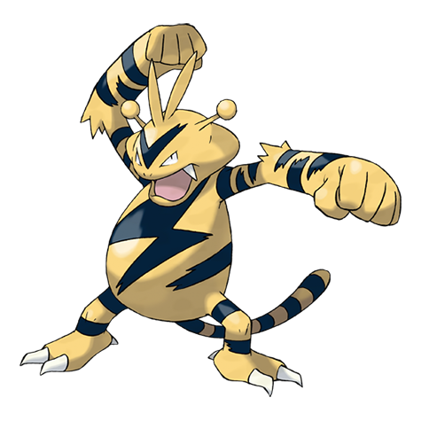

---
title: "Electabuzz (#0125)"
category: Pokedex
tags: [electabuzz, kanto, electric]
image: "assets/images/pokemon/125.png"
---

# Electabuzz (#0125)

*Electric Pokemon*

**Type:** Electric
**Abilities:** [[Static]], [[Vital Spirit]] *(Hidden)*
**Base HP:** 4

> A violent Pokemon. It searches for spots where it can feed on electricity and has been seen absorbing lightning from the sky. It’s competitive and aggressive with others.

---

## Statistiche (Attributes & Limits)

| Attribute | Base / Limit |
|---|---|
| **Strength** | 2/5 |
| **Dexterity** | 3/6 |
| **Vitality** | 2/4 |
| **Special** | 3/6 |
| **Insight** | 2/5 |

---

## Mosse (Learnset)

- **Starter:** [[Quick_Attack]], [[Leer]]
- **Beginner:** [[Thunder_Shock]], [[Low_Kick]]
- **Amateur:** [[Swift]], [[Shock_Wave]], [[Thunder_Wave]], [[Electro_Ball]], [[Light_Screen]], [[Thunder_Punch]]
- **Ace:** [[Discharge]], [[Screech]], [[Thunderbolt]], [[Thunder]]
- **Pro:** [[Dual_Chop]], [[Ice_Punch]], [[Meditate]]

