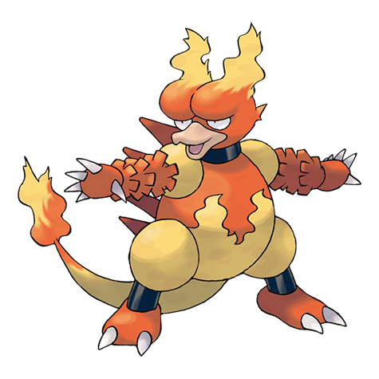

---
title: "Magmar (#0126)"
category: Pokedex
tags: [magmar, kanto, fire]
image: "assets/images/pokemon/126.png"
---

# Magmar (#0126)

*Spitfire Pokemon*

**Type:** Fire
**Abilities:** [[Flame Body]], [[Vital Spirit]] *(Hidden)*
**Base HP:** 4

> It can be found living in volcanic areas. In battle, Magmar blows out intense flames all over its body to intimidate the opponent. This creates heat waves that ignite grass and trees in the surroundings.

---

## Statistiche (Attributes & Limits)

| Attribute | Base / Limit |
|---|---|
| **Strength** | 3/6 |
| **Dexterity** | 2/5 |
| **Vitality** | 2/4 |
| **Special** | 3/6 |
| **Insight** | 2/5 |

---

## Mosse (Learnset)

- **Starter:** [[Smog]], [[Leer]], [[Ember]]
- **Beginner:** [[Smokescreen]], [[Feint_Attack]], [[Fire_Spin]]
- **Amateur:** [[Clear_Smog]], [[Flame_Burst]], [[Confuse_Ray]], [[Fire_Punch]], [[Sunny_Day]]
- **Ace:** [[Lava_Plume]], [[Flamethrower]], [[Fire_Blast]]
- **Pro:** [[Heat_Wave]], [[Karate_Chop]], [[Dual_Chop]]

