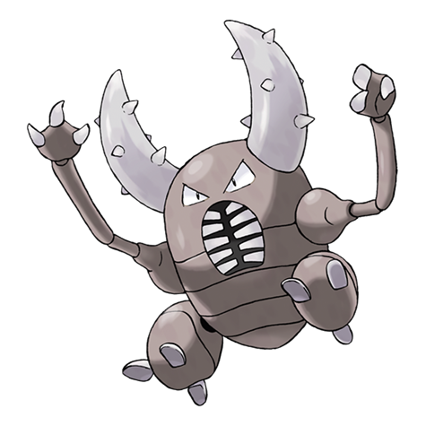
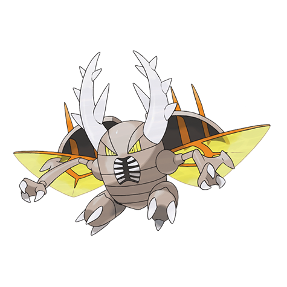

---
title: "Pinsir (#0127)"
category: Pokedex
tags: [pinsir, kanto, bug]
image: "assets/images/pokemon/127.png"
---

# Pinsir (#0127)

*Stagbeetle Pokemon*

**Type:** Bug
**Abilities:** [[Hyper Cutter]], [[Mold Breaker]], [[Moxie]] *(Hidden)*
**Base HP:** 4

> Their pincers are strong enough to shatter thick logs. Because they dislike cold, Pinsirs burrow and sleep under the ground on chilly nights. They like to eat sap and honey, but they are aggressive by nature.

---

## Statistiche (Attributes & Limits)

| Attribute | Base / Limit |
|---|---|
| **Strength** | 3/7 |
| **Dexterity** | 2/5 |
| **Vitality** | 3/6 |
| **Special** | 2/4 |
| **Insight** | 2/5 |

---

## Mosse (Learnset)

- **Starter:** [[Vice_Grip]], [[Focus_Energy]]
- **Beginner:** [[Bind]], [[Seismic_Toss]], [[Harden]]
- **Amateur:** [[Revenge]], [[Brick_Break]], [[Vital_Throw]], [[Double_Hit]], [[Submission]], [[X-Scissor]], [[Storm_Throw]]
- **Ace:** [[Thrash]], [[Swords_Dance]], [[Superpower]], [[Guillotine]]
- **Pro:** [[Iron_Defense]], [[Stealth_Rock]], [[Feint_Attack]]

---

## Forme Speciali

### Mega Pinsir

**Type:** Bug / Flying  
**Ability:** [[Aerialate]]  
**Base HP:** 5  ·  **Suggested Rank:** Ace  
**Height:** 1.7m / 5'07"  ·  **Weight:** 59kg / 130lbs

> With the power of the Mega Stone it develops wings and inhuman strength. It can lift foes heavier than itself and still fly with ease. Its mind is in a constant state of excitement and it cannot stay still.

 
