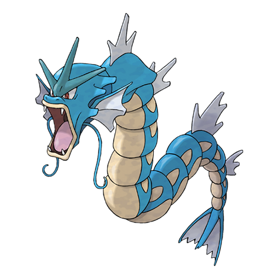
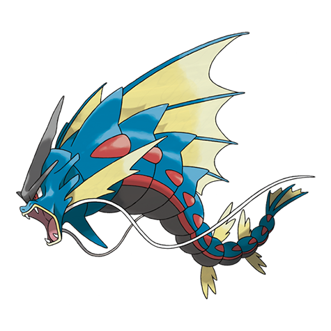

---
title: "Gyarados (#0130)"
category: Pokedex
tags: [gyarados, kanto, water, flying]
image: "assets/images/pokemon/130.png"
---

# Gyarados (#0130)

*Atrocious Pokemon*

**Type:** Water / Flying
**Abilities:** [[Intimidate]], [[Moxie]] *(Hidden)*
**Base HP:** 7

> It’s rarely seen in the wild. This huge and vicious Pokemon is known for the destruction it leaves in its wake. In ancient literature, there is a record of a Gyarados that razed a village when violence flared.

---

## Statistiche (Attributes & Limits)

| Attribute | Base / Limit |
|---|---|
| **Strength** | 3/7 |
| **Dexterity** | 2/5 |
| **Vitality** | 2/5 |
| **Special** | 2/4 |
| **Insight** | 3/6 |

---

## Mosse (Learnset)

- **Starter:** [[Dragon_Rage]], [[Leer]]
- **Beginner:** [[Twister]], [[Ice_Fang]], [[Scary_Face]], [[Bite]], [[Hurricane]]
- **Amateur:** [[Thrash]], [[Aqua_Tail]], [[Rain_Dance]], [[Crunch]], [[Dragon_Dance]]
- **Ace:** [[Hydro_Pump]], [[Hyper_Beam]]
- **Pro:** [[Thunder_Wave]], [[Outrage]], [[Bounce]]

---

## Forme Speciali

<strong>Mega Gyarados</strong>

