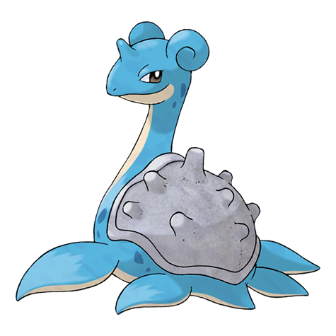
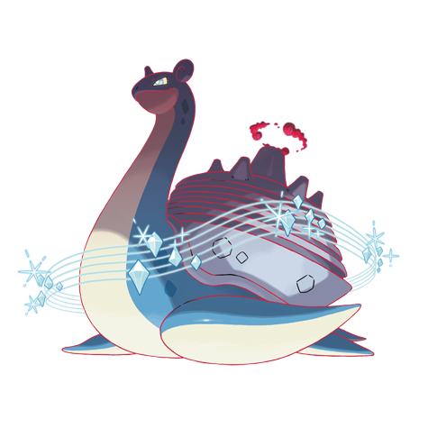

---
title: "Lapras (#0131)"
category: Pokedex
tags: [lapras, kanto, water, ice]
image: "assets/images/pokemon/131.png"
---

# Lapras (#0131)

*Transport Pokemon*

**Type:** Water / Ice
**Abilities:** [[Water Absorb]], [[Shell Armor]], [[Hydration]] *(Hidden)*
**Base HP:** 6

> People have driven Lapras near the point of extinction. In the evenings, this Pokemon is said to sing as it seeks what few others of its kind still remain. Their gentle nature has made them easy to lure and catch.

---

## Statistiche (Attributes & Limits)

| Attribute | Base / Limit |
|---|---|
| **Strength** | 2/5 |
| **Dexterity** | 2/4 |
| **Vitality** | 2/5 |
| **Special** | 2/5 |
| **Insight** | 3/6 |

---

## Mosse (Learnset)

- **Starter:** [[Sing]], [[Growl]]
- **Beginner:** [[Water_Gun]], [[Mist]]
- **Amateur:** [[Confuse_Ray]], [[Ice_Shard]], [[Water_Pulse]], [[Body_Slam]], [[Rain_Dance]], [[Brine]], [[Ice_Beam]]
- **Ace:** [[Perish_Song]], [[Safeguard]], [[Hydro_Pump]], [[Sheer_Cold]]
- **Pro:** [[Dragon_Dance]], [[Freeze_Dry]], [[Outrage]]

---

## Forme Speciali

<strong>Lapras (Gigantamax)</strong>

