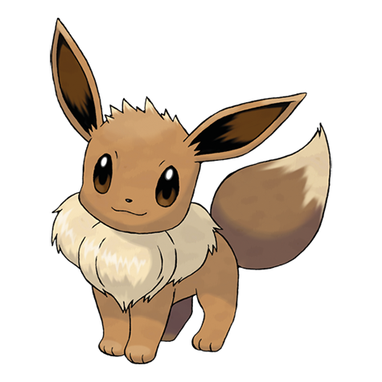
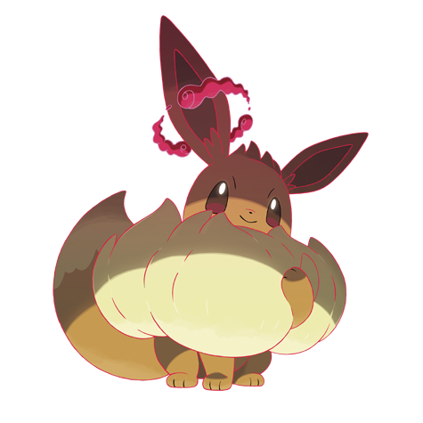

---
title: "Eevee (#0133)"
category: Pokedex
tags: [eevee, kanto, normal]
image: "assets/images/pokemon/133.png"
---

# Eevee (#0133)

*Evolution Pokemon*

**Type:** Normal
**Abilities:** [[Run_Away]], [[Adaptability]], [[Anticipation]] *(Hidden)*
**Base HP:** 3

> This Pokemon is extremely rare to find. Eevee has an unstable genetic makeup that suddenly mutates to fit its environment. Radiation from various stones causes this Pokemon to evolve.

---

## Statistiche (Attributes & Limits)

| Attribute | Base / Limit |
|---|---|
| **Strength** | 2/4 |
| **Dexterity** | 2/4 |
| **Vitality** | 2/4 |
| **Special** | 2/4 |
| **Insight** | 2/4 |

---

## Mosse (Learnset)

- **Starter:** [[Helping_Hand]], [[Growl]]
- **Beginner:** [[Tackle]], [[Tail_Whip]], [[Sand_Attack]]
- **Amateur:** [[Baby-Doll_Eyes]], [[Swift]], [[Quick_Attack]], [[Bite]], [[Refresh]], [[Covet]], [[Take_Down]], [[Charm]]
- **Ace:** [[Baton_Pass]], [[Double-Edge]], [[Last_Resort]], [[Trump_Card]]
- **Pro:** [[Wish]], [[Tickle]], [[Fake_Tears]]

---

## Forme Speciali

### Eevee (Gigantamax)

*Forma Gigantamax — richiede Dynamax Band e Pokémon Stadium, oppure Power Spot naturale.*

Vedi [[Max_Moves]] per le G-Max Moves disponibili e i relativi effetti.

 

---

## Correlati

### Catena Evolutiva
- [[0134_Vaporeon|Vaporeon]]
