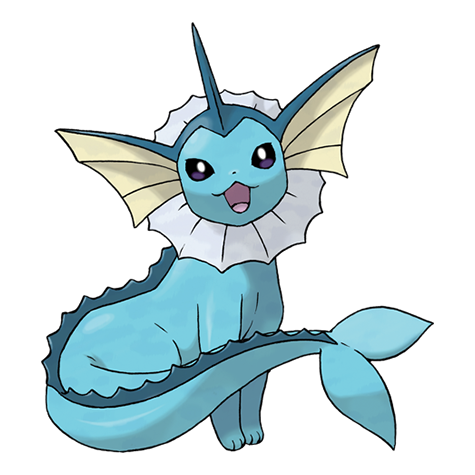

---
title: "Vaporeon (#0134)"
category: Pokedex
tags: [vaporeon, kanto, water]
image: "assets/images/pokemon/134.png"
---

# Vaporeon (#0134)

*Bubble Jet Pokemon*

**Type:** Water
**Abilities:** [[Water Absorb]], [[Hydration]] *(Hidden)*
**Base HP:** 6

> Vaporeon underwent through a strange mutation, it grew fins and gills that allow it to live underwater. This Pokemon has the ability to become translucent when it dives underwater.

---

## Statistiche (Attributes & Limits)

| Attribute | Base / Limit |
|---|---|
| **Strength** | 2/4 |
| **Dexterity** | 2/4 |
| **Vitality** | 2/4 |
| **Special** | 3/6 |
| **Insight** | 3/6 |

---

## Mosse (Learnset)

- **Starter:** [[Tackle]], [[Helping_Hand]]
- **Beginner:** [[Tail_Whip]], [[Sand_Attack]], [[Water_Gun]]
- **Amateur:** [[Quick_Attack]], [[Water_Pulse]], [[Aurora_Beam]], [[Aqua_Ring]], [[Acid_Armor]], [[Haze]]
- **Ace:** [[Muddy_Water]], [[Last_Resort]], [[Hydro_Pump]]
- **Pro:** [[Wish]], [[Icy_Wind]], [[Yawn]]

---

## Correlati

### Catena Evolutiva
- [[0133_Eevee|Eevee]]
