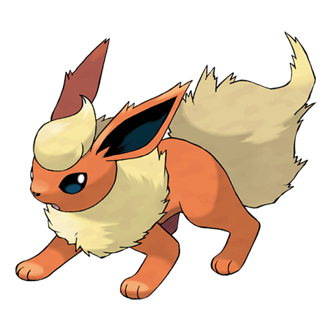

---
title: "Flareon (#0136)"
category: Pokedex
tags: [flareon, kanto, fire]
image: "assets/images/pokemon/136.png"
---

# Flareon (#0136)

*Flame Pokemon*

**Type:** Fire
**Abilities:** [[Flash Fire]], [[Guts]] *(Hidden)*
**Base HP:** 4

> A few have been seen in volcanic areas but just like its counterparts is more common to see it being the pet of wealthy people. Its flaming fur is most appreciated for its warm glow and silky touch.

---

## Statistiche (Attributes & Limits)

| Attribute | Base / Limit |
|---|---|
| **Strength** | 3/7 |
| **Dexterity** | 2/4 |
| **Vitality** | 2/4 |
| **Special** | 3/6 |
| **Insight** | 3/6 |

---

## Mosse (Learnset)

- **Starter:** [[Tackle]], [[Helping_Hand]]
- **Beginner:** [[Tail_Whip]], [[Sand_Attack]], [[Ember]]
- **Amateur:** [[Quick_Attack]], [[Bite]], [[Fire_Fang]], [[Fire_Spin]], [[Scary_Face]], [[Smog]]
- **Ace:** [[Lava_Plume]], [[Last_Resort]], [[Flare_Blitz]]
- **Pro:** [[Wish]], [[Detect]], [[Heat_Wave]]

---

## Correlati

### Catena Evolutiva
- [[0133_Eevee|Eevee]]
