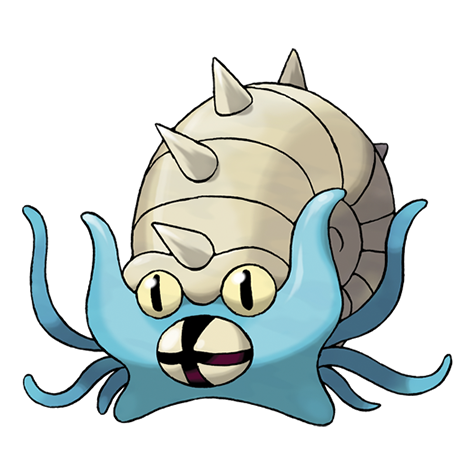

---
title: "Omastar (#0139)"
category: Pokedex
tags: [omastar, kanto, rock, water]
image: "assets/images/pokemon/139.png"
---

# Omastar (#0139)

*Spiral Pokemon*

**Type:** Rock / Water
**Abilities:** [[Swift Swim]], [[Shell Armor]], [[Weak Armor]] *(Hidden)*
**Base HP:** 4

> An Omastar used its tentacles to ensnare and capture its prey. It is believed to have become extinct because the shell grew too large, making it slow and ponderous. It is not found in the wild anymore.

---

## Statistiche (Attributes & Limits)

| Attribute | Base / Limit |
|---|---|
| **Strength** | 2/4 |
| **Dexterity** | 2/4 |
| **Vitality** | 3/7 |
| **Special** | 3/6 |
| **Insight** | 2/5 |

---

## Mosse (Learnset)

- **Starter:** [[Constrict]], [[Withdraw]]
- **Beginner:** [[Bite]], [[Water_Gun]], [[Rollout]]
- **Amateur:** [[Leer]], [[Mud_Shot]], [[Brine]], [[Protect]], [[Ancient_Power]], [[Spike_Cannon]], [[Tickle]]
- **Ace:** [[Rock_Blast]], [[Shell_Smash]], [[Hydro_Pump]]
- **Pro:** [[Toxic_Spikes]], [[Spikes]], [[Iron_Defense]]

---

## Correlati

### Catena Evolutiva
- [[0138_Omanyte|Omanyte]]
