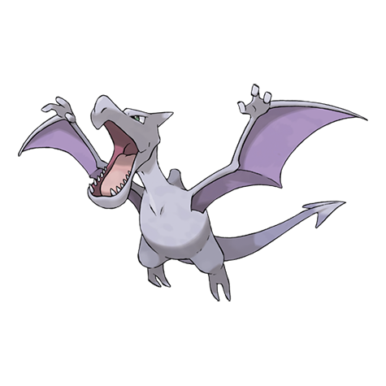
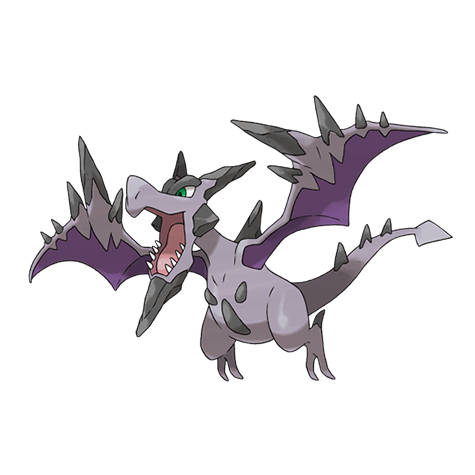

---
title: "Aerodactyl (#0142)"
category: Pokedex
tags: [aerodactyl, kanto, rock, flying]
image: "assets/images/pokemon/142.png"
---

# Aerodactyl (#0142)

*Fossil Pokemon*

**Type:** Rock / Flying
**Abilities:** [[Rock Head]], [[Pressure]], [[Unnerve]] *(Hidden)*
**Base HP:** 4

> A vicious Pokemon from the distant past. It appears to have flown by spreading its wings and gliding. One has been revived from a fossil. It’s very dangerous; it attacks with the intent to tear apart its victims.

---

## Statistiche (Attributes & Limits)

| Attribute | Base / Limit |
|---|---|
| **Strength** | 3/6 |
| **Dexterity** | 3/7 |
| **Vitality** | 2/4 |
| **Special** | 2/4 |
| **Insight** | 2/5 |

---

## Mosse (Learnset)

- **Starter:** [[Wing_Attack]], [[Supersonic]]
- **Beginner:** [[Bite]], [[Scary_Face]], [[Take_Down]]
- **Amateur:** [[Ice_Fang]], [[Thunder_Fang]], [[Fire_Fang]], [[Roar]], [[Agility]], [[Crunch]], [[Iron_Head]], [[Sky_Drop]]
- **Ace:** [[Hyper_Beam]], [[Rock_Slide]], [[Giga_Impact]]
- **Pro:** [[Dragon_Breath]], [[Roost]], [[Aqua_Tail]]

---

## Forme Speciali

### Mega Aerodactyl

**Type:** Rock / Flying  
**Ability:** [[Tough_Claws|Tough Claws]]  
**Base HP:** 5  ·  **Suggested Rank:** Pro  
**Height:** 2.1m / 7'00"  ·  **Weight:** 180kg / 396lbs

> With the power of the Mega Stone it restores the original appearance it had millions of years ago, with its body covered in sharp rocks. It is very aggressive and will attack anything that moves.

 
