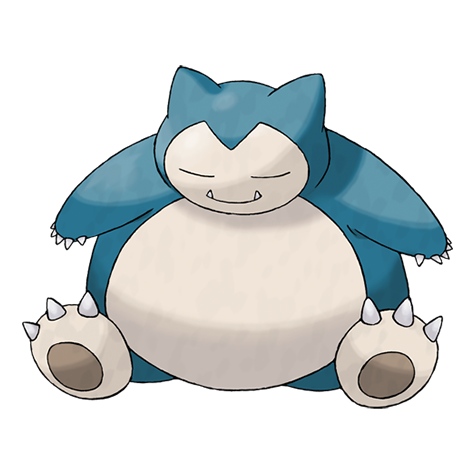
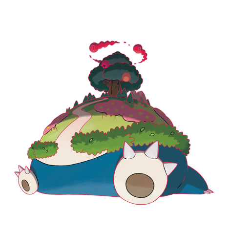

---
title: "Snorlax (#0143)"
category: Pokedex
tags: [snorlax, kanto, normal]
image: "assets/images/pokemon/143.png"
---

# Snorlax (#0143)

*Sleeping Pokemon*

**Type:** Normal
**Abilities:** [[Immunity]], [[Thick Fat]], [[Gluttony]] *(Hidden)*
**Base HP:** 8

> Snorlax's typical day consists of eating and sleeping. It is such a docile Pokemon that children use its big belly as a place to play. It only attacks when it’s awoken harshly. Fortunately it is a heavy sleeper.

---

## Statistiche (Attributes & Limits)

| Attribute | Base / Limit |
|---|---|
| **Strength** | 3/6 |
| **Dexterity** | 1/3 |
| **Vitality** | 2/4 |
| **Special** | 2/4 |
| **Insight** | 3/6 |

---

## Mosse (Learnset)

- **Starter:** [[Tackle]], [[Defense_Curl]]
- **Beginner:** [[Amnesia]], [[Lick]], [[Yawn]]
- **Amateur:** [[Chip_Away]], [[Body_Slam]], [[Rest]], [[Snore]], [[Sleep_Talk]], [[Rollout]], [[Block]], [[Crunch]]
- **Ace:** [[Belly_Drum]], [[Heavy_Slam]], [[Giga_Impact]], [[High_Horsepower]]
- **Pro:** [[Outrage]], [[Gunk_Shot]], [[Self_Destruct]]

---

## Forme Speciali

<strong>Snorlax (Gigantamax)</strong>

