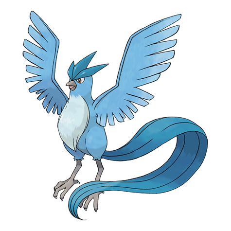

# Articuno (#0144)

*No Data*

**Type:** Ice / Flying
**Abilities:** [[Pressure]], [[Snow Cloak]] *(Hidden)*
**Base HP:** 4

> Rumor has it that one appeared during a blizzard in front of two lost hikers who followed its glistening trail until they found the main road. Others say its silhouette can be seen during raging snow storms.

---

## Statistiche (Attributes & Limits)

| Attribute | Base / Limit |
|---|---|
| **Strength** | 5/5 |
| **Dexterity** | 5/5 |
| **Vitality** | 6/6 |
| **Special** | 6/6 |
| **Insight** | 7/7 |

---

## Mosse (Learnset)

