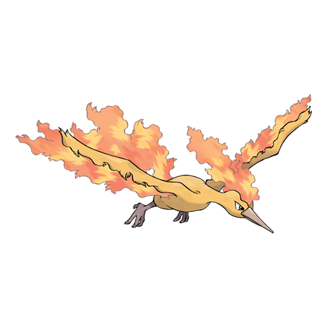

# Moltres (#0146)

*No Data*

**Type:** Fire / Flying
**Abilities:** [[Pressure]], [[Flame Body]] *(Hidden)*
**Base HP:** 4

> The legend speaks of a bird who came flying from the south. Its fiery body melted the snow and brought the spring along. A children‘s book depicts a similar Pokemon living inside of a volcano.

---

## Statistiche (Attributes & Limits)

| Attribute | Base / Limit |
|---|---|
| **Strength** | 6/6 |
| **Dexterity** | 5/5 |
| **Vitality** | 5/5 |
| **Special** | 7/7 |
| **Insight** | 5/5 |

---

## Mosse (Learnset)

