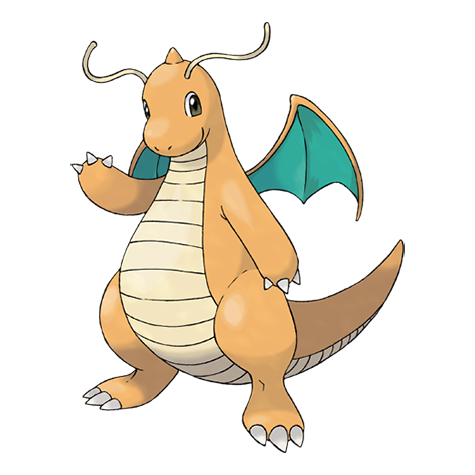

---
title: "Dragonite (#0149)"
category: Pokedex
tags: [dragonite, kanto, dragon, flying]
image: "assets/images/pokemon/149.png"
---

# Dragonite (#0149)

*Dragon Pokemon*

**Type:** Dragon / Flying
**Abilities:** [[Inner Focus]], [[Multiscale]] *(Hidden)*
**Base HP:** 6

> Very few people have ever seen this Pokemon. Its intelligence matches that of humans. There are records of a Pokemon with a similar description that helped rescue a ship full of people during a hurricane.

---

## Statistiche (Attributes & Limits)

| Attribute | Base / Limit |
|---|---|
| **Strength** | 3/7 |
| **Dexterity** | 2/5 |
| **Vitality** | 3/6 |
| **Special** | 3/6 |
| **Insight** | 3/6 |

---

## Mosse (Learnset)

- **Starter:** [[Leer]], [[Wrap]]
- **Beginner:** [[Twister]], [[Thunder_Wave]]
- **Amateur:** [[Fire_Punch]], [[Thunder_Punch]], [[Roost]], [[Dragon_Rage]], [[Slam]], [[Agility]], [[Dragon_Tail]], [[Aqua_Tail]], [[Dragon_Rush]], [[Safeguard]], [[Wing_Attack]]
- **Ace:** [[Dragon_Dance]], [[Outrage]], [[Hyper_Beam]], [[Hurricane]]
- **Pro:** [[Extreme_Speed]], [[Draco_Meteor]], [[Tailwind]]

---

## Correlati

### Catena Evolutiva
- [[0147_Dratini|Dratini]]
- [[0148_Dragonair|Dragonair]]
