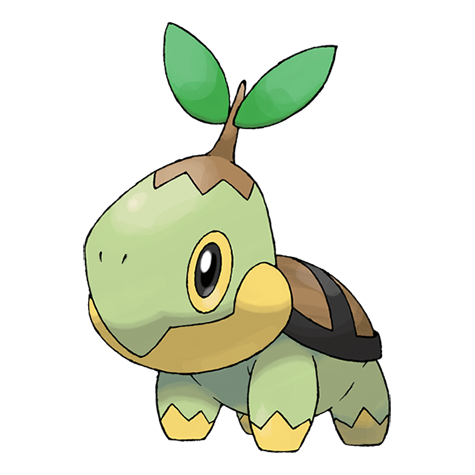

# Turtwig (#0387)

*Tiny Leaf Pokemon*

**Type:** Erba
**Abilities:** [[Overgrow]], [[Shell Armor]] *(Hidden)*
**Base HP:** 3

> It makes its home close to lakes, although it is rare to find one. The shell on its back is made of hardened soil and should be moist for it to be healthy. It uses photosynthesis to get energy.

---

## Statistiche (Attributes & Limits)

| Attribute | Base / Limit |
|---|---|
| **Strength** | 2/4 |
| **Dexterity** | 1/3 |
| **Vitality** | 2/4 |
| **Special** | 2/4 |
| **Insight** | 2/4 |

---

## Mosse (Learnset)

- **Starter:** [[Tackle|Tackle]]
- **Beginner:** [[Withdraw|Withdraw]], [[Absorb|Absorb]]
- **Amateur:** [[Razor_Leaf|Razor Leaf]], [[Curse|Curse]], [[Bite|Bite]], [[Mega_Drain|Mega Drain]], [[Leech_Seed|Leech Seed]], [[Synthesis|Synthesis]]
- **Ace:** [[Crunch|Crunch]], [[Giga_Drain|Giga Drain]], [[Leaf_Storm|Leaf Storm]]
- **Pro:** [[Mud_Slap|Mud Slap]], [[Seed_Bomb|Seed Bomb]], [[Grass_Pledge|Grass Pledge]]

---

## Correlati

### Catena Evolutiva
- [[0387_Turtwig|Turtwig]]
- [[0388_Grotle|Grotle]]
- [[0389_Torterra|Torterra]]
