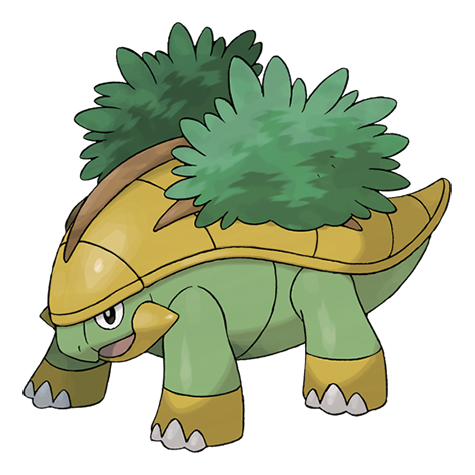

# Grotle (#0388)

*Grove Pokemon*

**Type:** Erba
**Abilities:** [[Overgrow]], [[Shell Armor]] *(Hidden)*
**Base HP:** 4

> Other Pokemon harass Grotle when the bushes on its back have berries or fruit. It patiently waits for others to finish eating before moving. It loves clear water and it’s good at finding cool ponds and springs.

---

## Statistiche (Attributes & Limits)

| Attribute | Base / Limit |
|---|---|
| **Strength** | 2/5 |
| **Dexterity** | 1/3 |
| **Vitality** | 2/5 |
| **Special** | 2/4 |
| **Insight** | 2/4 |

---

## Mosse (Learnset)

- **Starter:** [[Tackle|Tackle]]
- **Beginner:** [[Withdraw|Withdraw]], [[Absorb|Absorb]]
- **Amateur:** [[Razor_Leaf|Razor Leaf]], [[Curse|Curse]], [[Bite|Bite]], [[Mega_Drain|Mega Drain]], [[Leech_Seed|Leech Seed]], [[Synthesis|Synthesis]]
- **Ace:** [[Crunch|Crunch]], [[Giga_Drain|Giga Drain]], [[Leaf_Storm|Leaf Storm]]
- **Pro:** [[Superpower|Superpower]], [[Grassy_Terrain|Grassy Terrain]], [[Grass_Pledge|Grass Pledge]]

---

## Correlati

### Catena Evolutiva
- [[0387_Turtwig|Turtwig]]
- [[0388_Grotle|Grotle]]
- [[0389_Torterra|Torterra]]
