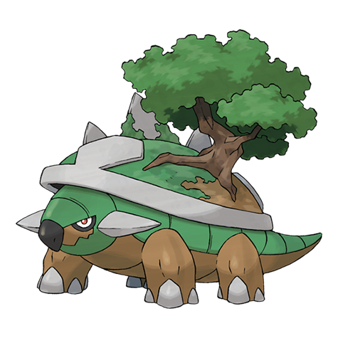

# Torterra (#0389)

*Continent Pokemon*

**Type:** Erba / Terra
**Abilities:** [[Overgrow]], [[Shell Armor]] *(Hidden)*
**Base HP:** 5

> Torterras travel in groups, mistaken as moving forests. Many pokemon make their nest on its back and live there for their entire lives. Ancient people thought that they lived on the back of a giant Torterra.

---

## Statistiche (Attributes & Limits)

| Attribute | Base / Limit |
|---|---|
| **Strength** | 3/6 |
| **Dexterity** | 2/4 |
| **Vitality** | 3/6 |
| **Special** | 2/5 |
| **Insight** | 2/5 |

---

## Mosse (Learnset)

- **Starter:** [[Tackle|Tackle]]
- **Beginner:** [[Withdraw|Withdraw]], [[Absorb|Absorb]]
- **Amateur:** [[Razor_Leaf|Razor Leaf]], [[Bite|Bite]], [[Curse|Curse]], [[Earthquake|Earthquake]], [[Mega_Drain|Mega Drain]], [[Synthesis|Synthesis]], [[Leech_Seed|Leech Seed]]
- **Ace:** [[Wood_Hammer|Wood Hammer]], [[Crunch|Crunch]], [[Giga_Drain|Giga Drain]], [[Leaf_Storm|Leaf Storm]]
- **Pro:** [[Outrage|Outrage]], [[Wide_Guard|Wide Guard]], [[Frenzy_Plant|Frenzy Plant]]

---

## Correlati

### Catena Evolutiva
- [[0387_Turtwig|Turtwig]]
- [[0388_Grotle|Grotle]]
- [[0389_Torterra|Torterra]]
