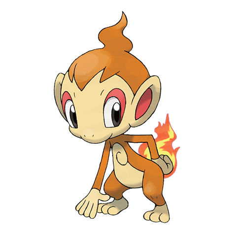

# Chimchar (#0390)

*Chimp Pokemon*

**Type:** Fuoco
**Abilities:** [[Blaze]], [[Iron Fist]] *(Hidden)*
**Base HP:** 3

> They climb sheer cliffs to live at the top of the mountains. Small groups of them tend to visit human camping sites to steal food and objects. They are playful and will wreak havoc if they want to have fun.

---

## Statistiche (Attributes & Limits)

| Attribute | Base / Limit |
|---|---|
| **Strength** | 2/4 |
| **Dexterity** | 2/4 |
| **Vitality** | 1/3 |
| **Special** | 2/4 |
| **Insight** | 1/3 |

---

## Mosse (Learnset)

- **Starter:** [[Leer|Leer]], [[Scratch|Scratch]]
- **Beginner:** [[Ember|Ember]], [[Taunt|Taunt]]
- **Amateur:** [[Fury_Swipes|Fury Swipes]], [[Flame_Wheel|Flame Wheel]], [[Nasty_Plot|Nasty Plot]], [[Torment|Torment]], [[Facade|Facade]], [[Fire_Spin|Fire Spin]]
- **Ace:** [[Acrobatics|Acrobatics]], [[Slack_Off|Slack Off]], [[Flamethrower|Flamethrower]]
- **Pro:** [[Helping_Hand|Helping Hand]], [[Fake_Out|Fake Out]], [[Fire_Pledge|Fire Pledge]]

---

## Correlati

### Catena Evolutiva
- [[0390_Chimchar|Chimchar]]
- [[0391_Monferno|Monferno]]
- [[0392_Infernape|Infernape]]
