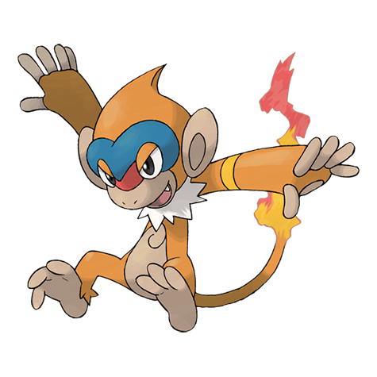

# Monferno (#0391)

*Playful Pokemon*

**Type:** Fuoco / Lotta
**Abilities:** [[Blaze]], [[Iron Fist]] *(Hidden)*
**Base HP:** 4

> It bounces off walls and ceilings to launch aerial attacks. They live in packs in distant mountains. The size of their flame and the blue pattern on their faces determine their rank. They are small but very strong.

---

## Statistiche (Attributes & Limits)

| Attribute | Base / Limit |
|---|---|
| **Strength** | 2/5 |
| **Dexterity** | 2/5 |
| **Vitality** | 2/4 |
| **Special** | 2/5 |
| **Insight** | 2/4 |

---

## Mosse (Learnset)

- **Starter:** [[Scratch|Scratch]], [[Leer|Leer]]
- **Beginner:** [[Ember|Ember]], [[Taunt|Taunt]]
- **Amateur:** [[Mach_Punch|Mach Punch]], [[Fury_Swipes|Fury Swipes]], [[Flame_Wheel|Flame Wheel]], [[Feint|Feint]], [[Torment|Torment]], [[Fire_Spin|Fire Spin]]
- **Ace:** [[Close_Combat|Close Combat]], [[Acrobatics|Acrobatics]], [[Slack_Off|Slack Off]], [[Flare_Blitz|Flare Blitz]]
- **Pro:** [[Fire_Punch|Fire Punch]], [[Thunder_Punch|Thunder Punch]], [[Fire_Pledge|Fire Pledge]]

---

## Correlati

### Catena Evolutiva
- [[0390_Chimchar|Chimchar]]
- [[0391_Monferno|Monferno]]
- [[0392_Infernape|Infernape]]
