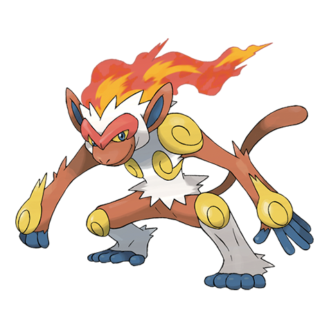

# Infernape (#0392)

*Flame Pokemon*

**Type:** Fuoco / Lotta
**Abilities:** [[Blaze]], [[Iron Fist]] *(Hidden)*
**Base HP:** 5

> Its fire crown showcases its proud and fiery nature. Infernape won’t hesitate to fight bigger foes and will take on any challenge they face. Once Infernape enters a battle, it won’t back down until it wins.

---

## Statistiche (Attributes & Limits)

| Attribute | Base / Limit |
|---|---|
| **Strength** | 3/6 |
| **Dexterity** | 3/6 |
| **Vitality** | 2/5 |
| **Special** | 3/6 |
| **Insight** | 2/5 |

---

## Mosse (Learnset)

- **Starter:** [[Leer|Leer]], [[Scratch|Scratch]]
- **Beginner:** [[Taunt|Taunt]], [[Ember|Ember]]
- **Amateur:** [[Fury_Swipes|Fury Swipes]], [[Mach_Punch|Mach Punch]], [[Feint|Feint]], [[Flame_Wheel|Flame Wheel]], [[Fire_Spin|Fire Spin]], [[Punishment|Punishment]]
- **Ace:** [[Close_Combat|Close Combat]], [[Flare_Blitz|Flare Blitz]], [[Acrobatics|Acrobatics]], [[Calm_Mind|Calm Mind]]
- **Pro:** [[Endure|Endure]], [[Dual_Chop|Dual Chop]], [[Blast_Burn|Blast Burn]]

---

## Correlati

### Catena Evolutiva
- [[0390_Chimchar|Chimchar]]
- [[0391_Monferno|Monferno]]
- [[0392_Infernape|Infernape]]
