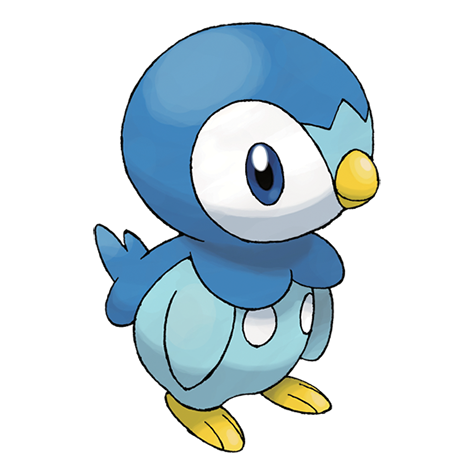

# Piplup (#0393)

*Penguin Pokemon*

**Type:** Acqua
**Abilities:** [[Torrent]], [[Defiant]] *(Hidden)*
**Base HP:** 3

> Piplups are extremely proud. They won’t take anything from anyone nor accept being taken care of. It lives along shores in northern countries. It is a good swimmer but terrible at walking, it trips over often.

---

## Statistiche (Attributes & Limits)

| Attribute | Base / Limit |
|---|---|
| **Strength** | 2/4 |
| **Dexterity** | 1/3 |
| **Vitality** | 2/4 |
| **Special** | 2/4 |
| **Insight** | 2/4 |

---

## Mosse (Learnset)

- **Starter:** [[Pound|Pound]], [[Growl|Growl]]
- **Beginner:** [[Bubble|Bubble]], [[Water_Sport|Water Sport]]
- **Amateur:** [[Peck|Peck]], [[Bubble_Beam|Bubble Beam]], [[Bide|Bide]], [[Fury_Attack|Fury Attack]], [[Brine|Brine]], [[Whirlpool|Whirlpool]]
- **Ace:** [[Mist|Mist]], [[Drill_Peck|Drill Peck]], [[Hydro_Pump|Hydro Pump]]
- **Pro:** [[Icy_Wind|Icy Wind]], [[Flail|Flail]], [[Water_Pledge|Water Pledge]]

---

## Correlati

### Catena Evolutiva
- [[0393_Piplup|Piplup]]
- [[0394_Prinplup|Prinplup]]
- [[0395_Empoleon|Empoleon]]
